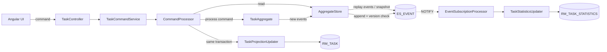

# Todo — an event-sourced task manager on jEAP building blocks

A complete, runnable todo application that is deliberately over-engineered in exactly one direction:
**every state change is stored as an immutable event**, and every view of a task is derived from that
event stream.

Two open-source bodies of work are combined here:

| Source | What is taken from it |
| --- | --- |
| [jeap-admin-ch](https://github.com/jeap-admin-ch) — the Swiss Confederation's Java Enterprise Application Platform | the Maven parent and dependency management, the Spring Boot starters for security, monitoring, logging, Swagger and DB migration, the OAuth mock server, the naming conventions, and [Oblique](https://oblique.bit.admin.ch/) for the Angular front end |
| [eugene-khyst/postgresql-event-sourcing](https://github.com/eugene-khyst/postgresql-event-sourcing) (Apache-2.0) | the event-store design: aggregate/event/snapshot/subscription tables, optimistic concurrency control, the transactional outbox based on `pg_current_xact_id()`, and `LISTEN`/`NOTIFY`-driven subscriptions |

> This is a sample application. It is not an official service of any organization, and the operator
> and contact details in the UI are fictional.

## What you can see running

1. **Commands, not updates.** `POST /api/tasks` appends `TODO_TASK_CREATED`; completing a task appends
   `TODO_TASK_COMPLETED`. `UPDATE` and `DELETE` are never issued against the event table.
2. **Two read models from one stream.** `rm_task` is written synchronously inside the command
   transaction; `rm_task_statistics` is written by an asynchronous, checkpointed subscription.
3. **Time travel.** The task detail page replays the aggregate at any version — the slider re-reads
   the task as it was after event *n*.
4. **A real OAuth2 login.** The Angular UI runs an authorization-code + PKCE flow against the jEAP
   OAuth mock server; the service validates the JWT and authorizes semantic roles
   (`todo_@task_#read`, `todo_@task_#write`).

## Run it

```bash
docker compose up --build
```

| Service | URL | Notes |
| --- | --- | --- |
| UI | <http://localhost:4200> | log in as `anna` (read + write) or `ben` (read only) |
| API | <http://localhost:8080/swagger-ui.html> | OpenAPI UI |
| OIDC mock | <http://localhost:8180/jeap-oauth-mock-server> | issues jEAP-shaped tokens |
| PostgreSQL | `localhost:5432` | user/password/database `todo`, schema `data` |

Without Docker: start a PostgreSQL, then `./mvnw spring-boot:run` in `backend/todo-oauth-mock-server`
and `backend/todo-task-service`, and `npm start` in `frontend/todo-task-ui`.

## Repository layout

```
backend/
  todo-eventsourcing-core/   reusable event store (aggregates, events, snapshots, subscriptions)
  todo-task-service/         the task bounded context: commands, aggregate, read models, REST API
  todo-oauth-mock-server/    local OIDC provider (jEAP OAuth mock server instance)
frontend/
  todo-task-ui/              Angular 21 + Oblique single-page application
docs/
  architecture.md            diagrams and the reasoning behind the design
```

## The write model



A command never mutates state directly. `TaskAggregate` decides whether the command is legal, emits an
event, and applies it to itself; `AggregateStore` then appends the events under an optimistic version
check:

```sql
UPDATE ES_AGGREGATE SET VERSION = :newVersion WHERE ID = :aggregateId AND VERSION = :expectedVersion
```

If no row is updated, another transaction got there first and the API answers `409 Conflict`.

## Reading the stream reliably

Asynchronous handlers are driven by a checkpoint per subscription, and only events from *committed*
transactions are handed out:

```sql
WHERE (e.TRANSACTION_ID, e.ID) > (:lastTransactionId::xid8, :lastEventId)
  AND e.TRANSACTION_ID < pg_snapshot_xmin(pg_current_snapshot())
```

`pg_snapshot_xmin` is what makes this a correct transactional outbox: an event written by a
still-in-flight transaction is skipped until that transaction commits, so no event is ever missed by
an advancing checkpoint. The subscription row itself is taken with `FOR UPDATE SKIP LOCKED`, so
several service instances process different subscriptions without blocking each other.

## API

| Method | Path | Role | Purpose |
| --- | --- | --- | --- |
| `POST` | `/api/tasks` | `task/write` | create a task |
| `GET` | `/api/tasks?status=OPEN` | `task/read` | list the caller's tasks (read model) |
| `GET` | `/api/tasks/{id}` | `task/read` | one task (read model) |
| `PUT` | `/api/tasks/{id}` | `task/write` | change title, description, priority, due date |
| `PUT` | `/api/tasks/{id}/assignee` | `task/write` | assign the task |
| `PUT` | `/api/tasks/{id}/status` | `task/write` | complete, reopen or delete |
| `DELETE` | `/api/tasks/{id}` | `task/write` | delete (an event, not a row removal) |
| `GET` | `/api/tasks/{id}/events` | `task/read` | the full event stream of one task |
| `GET` | `/api/tasks/{id}/versions/{n}` | `task/read` | the task replayed at version *n* |
| `GET` | `/api/statistics` | `task/read` | counters from the asynchronous subscription |

## Tests

```bash
cd backend && ./mvnw verify
```

`TaskAggregateTest` covers the decision logic without a database. `TaskControllerIT` runs the whole
service against a PostgreSQL container: it appends events, reads both projections, replays an older
version, and waits for the asynchronous subscription to catch up.

## Design decisions

See [docs/architecture.md](docs/architecture.md) for the details, including where this implementation
deviates from `postgresql-event-sourcing` and why.

## License

Apache-2.0. See [LICENSE](LICENSE) and [NOTICE](NOTICE).
