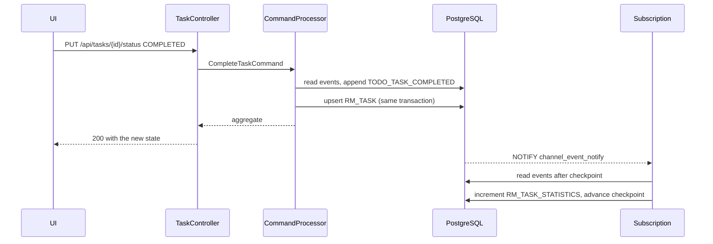

# Architecture

## Bounded context and naming

jEAP's [naming conventions](https://github.com/jeap-admin-ch/jeap/blob/main/docs/naming-conventions.md)
name a deployable `<system>-<context>-<typeid>`. The system is `todo`, the bounded context is `task`,
so the deployables are `todo-task-service` and `todo-task-ui`. Events follow
`<System><BusinessObject><VerbPastTense>Event` — `TodoTaskCreatedEvent`, `TodoTaskCompletedEvent` —
and commands `<Verb><BusinessObject>Command` — `CreateTaskCommand`, `CompleteTaskCommand`.

The service is layered as a hexagon:

```
domain/         aggregate, commands, events — no Spring, no SQL
application/    command and query services, event handlers, current user
adapter/web/    controllers, DTOs, problem details
adapter/persistence/  read-model rows and their repositories
config/         security, CORS, application properties
```

## The event store

Four tables, all created by Flyway in the `data` schema (jEAP configures `data` as the default schema
rather than the deprecated `public`):

| Table | Purpose |
| --- | --- |
| `ES_AGGREGATE` | one row per aggregate, holding the current version used for optimistic locking |
| `ES_EVENT` | the append-only stream: `(AGGREGATE_ID, VERSION)` is unique, `TRANSACTION_ID` orders globally |
| `ES_AGGREGATE_SNAPSHOT` | every *n*-th version serialized, so long streams do not have to be replayed in full |
| `ES_EVENT_SUBSCRIPTION` | one checkpoint per asynchronous handler |

Reading an aggregate takes the newest snapshot at or below the requested version and replays the
events after it. Writing appends events and, when snapshotting is enabled for the aggregate type,
stores a snapshot at every *n*-th version.

## Synchronous vs. asynchronous read models



`RM_TASK` is updated inside the command's transaction because the UI reads it immediately after the
command returns; an eventually-consistent list would show the user their own change missing.
`RM_TASK_STATISTICS` counts events over time (how often tasks were reopened, for instance) — a number
the current state cannot answer — and is therefore maintained from the committed stream, at-least-once.
Its writes are increments keyed by owner, so re-delivery after a crash converges rather than corrupts.

## Where this deviates from postgresql-event-sourcing

The event-store design is taken from
[eugene-khyst/postgresql-event-sourcing](https://github.com/eugene-khyst/postgresql-event-sourcing).
Four deliberate changes:

1. **`createdDate` is a constructor parameter, not a field initializer.** In the reference, `Event`
   initializes `createdDate = OffsetDateTime.now()`, so a replayed event carries the time it was
   *deserialized*. Here the timestamp round-trips through the JSON payload, which is what makes the
   event history and the replayed aggregate show the original times.
2. **The core is a Spring Boot auto-configuration**, not a component-scanned package: beans are
   declared in `EventSourcingAutoConfiguration` and registered through
   `AutoConfiguration.imports`, the way the jEAP starters are built.
3. **The notification listener starts on `ContextRefreshedEvent`**, not `@PostConstruct` — the
   subscription tables are created by Flyway during context refresh, and a listener that starts
   earlier fails its first poll.
4. **Events carry the actor** (`initiatedBy`), taken from the authenticated principal, so the history
   in the UI can say who did what.

## Security

`jeap-spring-boot-security-starter` turns the service into an OAuth2 resource server. Setting
`jeap.security.oauth2.resourceserver.system-name: todo` activates *semantic* roles, so authorization
reads `@PreAuthorize("hasRole('task', 'write')")` and the token carries `todo_@task_#write`.

Two things are worth pointing out:

- **Functional vs. data authorization.** The role check on the REST layer answers "may this user
  perform this operation"; whether the user may touch *this* task is checked after loading it, by
  comparing the owner — jEAP's guidance separates the two, and so does this service.
- **A custom filter chain for `/api/**`.** The starter's default chain enables cookie-based CSRF
  protection, which a cross-origin, bearer-token SPA cannot satisfy. `WebSecurityConfiguration`
  overrides the chain for the API: stateless, CORS-enabled, CSRF off, same jEAP JWT decoder and
  authentication converter.

## Operating notes

- `database-migration.startup-migrate-mode-enabled` is `true` by default here. The jEAP DB-migration
  starter otherwise expects a dedicated migration init container whenever it detects Kubernetes, and
  the application container then refuses to start while migrations are pending.
- `event-sourcing.subscriptions` switches between `postgres-channel` (LISTEN/NOTIFY, the default) and
  `polling` for environments where a long-lived listening connection is not available.
- Snapshots are configured per aggregate type under `event-sourcing.snapshotting`.
- `jeap.swagger.status` is `DISABLED` by default in the starter — a deny-all filter chain in front of
  the Swagger paths. This sample sets it to `OPEN`; a real deployment would leave it closed or use
  `SECURED`.
